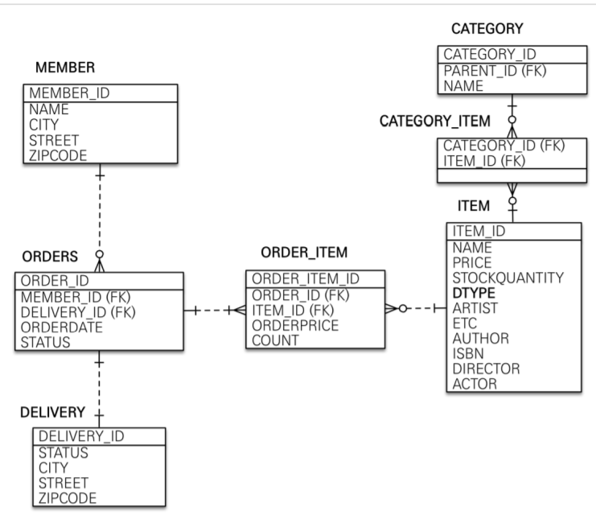
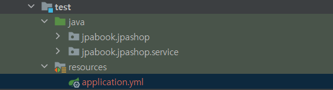

# JPA Shop

## 기능 목록

- 회원 기능
  - 회원 등록 -회원 조회
- 상품 기능
  - 상품 등록
  - 상품 수정
  - 상품 조회
- 주문 기능
  - 상품 주문
  - 주문 내역 조회
  - 주문 취소
- 기타 요구사항
  - 상품은 재고 관리가 필요하다.
  - 상품의 종류는 도서, 음반, 영화가 있다.
  - 상품을 카테고리로 구분할 수 있다.

## ER Diagram



# JPA

## 설계시 주의점

### **외래 키가 있는 곳을 연관관계의 주인으로 정해라**

- 연관관계의 주인은 단순히 외래 키를 누가 관리하냐의 문제이지 비즈니스상 우위에 있다고 주인으로 정하면 안된다.
- 위에서 member와 orders의 관계에서 orders가 member의 PK를 가지고 있기 때문에

```java
//Order
@JoinColumn(name = "member_id") // foreigner key id = member_id
private Member member;

//Member
@OneToMany(mappedBy = "member") //mappedBy를 통해 order 엔티티의 member 변수에 매핑된 변수라는 것을 알려줌. 변경은 order의 member를 통해서만 해야함 (읽기전용으로됨)
private List<Order> orders = new ArrayList<>();
```

이렇게 설정해줘야 한다.
DB에 영향을 줄 수 있는 것은 JoinColumn으로 설정한 Order쪽이고,
Member쪽의 orders는 읽기만 가능하다.

### **Embedded를 사용해서 응집력을 높여라**

- JPA에서 새로운 값 타입을 직접 정의해서 사용하는 것

```java
//Member
@Embedded
private Address address;

//Address
@Embeddable
@Getter
public class Address {

    private String city;
    private String street;
    private String zipcode;

    protected Address() {
    }

    public Address(String city, String street, String zipcode) {
        this.city = city;
        this.street = street;
        this.zipcode = zipcode;
    }
}
```

- Member에 city, street, zipcode를 전부 넣는 것보다 따로 Address를 만들면 응집력이 올라가고, Address에 의미있는 메서드를 정의하여 사용할 수 있다.

### **가급적 Setter는 사용하지 말자**

- Setter가 열려있으면 변경 포인트가 너무 많아서 유지보수가 어렵다. 나중에 리펙토링을 통해 Setter를 제거해야한다.

### **모든 연관관계는 지연로딩으로 설정**

- 즉시로딩(EAGER)은 예측이 어렵고, 어떤 SQL이 시랭될지 추적하기 어려움
- 특히 JPQL을 실행할 때 N+1문제가 자주 발생
- @XToOne관계는 기본이 EAGER이기 때문에 직접 LAZY로 설정해야 한다.

```java
//Order
@ManyToOne(fetch = FetchType.LAZY)
@JoinColumn(name = "member_id") // foreigner key id = member_id
private Member member;
```

- N+1 문제란 위에서 모든 Order를 검색하는 쿼리를 날렸을 때 10개의 Order가 있었다면,
  각 Order마다 10번의 member를 찾는 쿼리가 발생해서 전체 Order 조회쿼리 + N개의 추가 쿼리가 발생하는 경우를 말한다.
- 찾아보니 LAZY로 설정만 해줘서는 안되고 추가적인 방법 (Fetch join, EntityGraph등을 사용해서 처리해줘야함)

### **Enum은 String type으로**

- 순서타입으로 할 경우 나중에 Enum을 중간에 추가했을 경우 심각한 문제가 발생

```java
    @Enumerated(EnumType.STRING) //ORDINAL은 enum을 순서를 기반으로 접근하는 것이기 떄문에 나중에 enum에 뭔가 추가됐을 때 치명적이기 때문에 절대 사용 X
    private DeliveryStatus status; //READY, COMP
```

### **컬렉션은 필드에서 초기화 하자**

- null 문제에서 안전
- 하이버네이트는 엔티티를 영속화 할 때, 컬랙션을 감싸서 하이버네이트가 제공하는 내장 컬렉션으로 변경한
  다. 만약 getOrders() 처럼 임의의 메서드에서 컬력션을 잘못 생성하면 하이버네이트 내부 메커니즘에 문
  제가 발생할 수 있다. 따라서 필드레벨에서 생성하는 것이 가장 안전하고, 코드도 간결하다
  ```java
  private List<OrderItem> orderItems = new ArrayList<>();
  ```

### 객체 생성은 생성 메서드를 만들어 활용하자

```java
    //== 생성 메서드==//
    public static Order createOrder(Member member, Delivery delivery, OrderItem... orderItems) {
        Order order = new Order();
        order.setMember(member);
        order.setDelivery(delivery);

        for (OrderItem orderItem : orderItems) {
            order.addOrderItem(orderItem);
        }

        order.setStatus(OrderStatus.ORDER);
        order.setOrderDate(LocalDateTime.now());

        return order;
    }
```

이때 기본 생성자의 접근권한을 변경해주는 것이 다른 사람도 알기 쉬움

```java
@NoArgsConstructor(access = AccessLevel.PROTECTED)
public class Order {
  ...
}
```

# Test Code

### Test를 할 때 DB를 in-memory 방식으로 사용할 수 있다.



- 이처럼 test 폴더에 resources를 추가하고,

```yml
spring:
#  datasource:
#    url: jdbc:h2:mem:test
#    username: sa
#    password:
#    driver-class-name: org.h2.Driver
#
#  jpa:
#    hibernate:
#      ddl-auto: create-drop
#    properties:
#      hibernate:
##        show_sql: true #시스템 out으로 찍기때문에 아래 log로 찍는 방식이 더 올바름
#        format_sql: true
# 스프링 부트는 별도의 설정이 없으면 test시 memory mode로 돌린다.

logging:
  level:
    org.hibernate.SQL: debug
    org.hibernate.type: trace
```

- 이렇게 설정해주면 in-memory 방식으로 테스트할 수 있다. (spring boot는 기본 테스트 방식이 in-memory이기 때문에 아무 설정도 안해줄 경우 in-memory방식)

### 예외 처리 확인 테스트하는 방법

```java
    @Test(expected = IllegalStateException.class)
    public void 중복_회원_예외() throws Exception {
        //given
        Member member1 = new Member();
        member1.setName("kim");

        Member member2 = new Member();
        member2.setName("kim");

        //when
        memberService.join(member1);
        memberService.join(member2); // 예외 발생

        //then
        fail("예외가 발생해야 한다.");

    }
```

- 예외처리가 잘되나 확인하려면 @Test(expected = IllegalStateException.class)사용
- then에 fail 처리를 해놔야 예외처리가 안될 경우를 처리할 수 있다.

# 기타

## 도메인 모델 패턴

> 주문 서비스의 주문과 주문 취소 메서드를 보면 비즈니스 로직 대부분이 엔티티에 있다. 서비스 계층
> 은 단순히 엔티티에 필요한 요청을 위임하는 역할을 한다. 이처럼 엔티티가 비즈니스 로직을 가지고 객체 지
> 향의 특성을 적극 활용하는 것을 도메인 모델 패턴(http://martinfowler.com/eaaCatalog/
> domainModel.html)이라 한다. 반대로 엔티티에는 비즈니스 로직이 거의 없고 서비스 계층에서 대부분
> 의 비즈니스 로직을 처리하는 것을 트랜잭션 스크립트 패턴(http://martinfowler.com/eaaCatalog/
> transactionScript.html)이라 한다.
