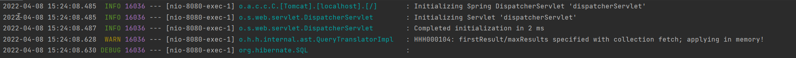

# JPA Shop

## 기능 목록

- 회원 기능
  - 회원 등록 -회원 조회
- 상품 기능
  - 상품 등록
  - 상품 수정
  - 상품 조회
- 주문 기능
  - 상품 주문
  - 주문 내역 조회
  - 주문 취소
- 기타 요구사항
  - 상품은 재고 관리가 필요하다.
  - 상품의 종류는 도서, 음반, 영화가 있다.
  - 상품을 카테고리로 구분할 수 있다.

## ER Diagram


# JPA

## 설계시 주의점

### **외래 키가 있는 곳을 연관관계의 주인으로 정해라**

- 연관관계의 주인은 단순히 외래 키를 누가 관리하냐의 문제이지 비즈니스상 우위에 있다고 주인으로 정하면 안된다.
- 위에서 member와 orders의 관계에서 orders가 member의 PK를 가지고 있기 때문에

```java
//Order
@JoinColumn(name = "member_id") // foreigner key id = member_id
private Member member;

//Member
@OneToMany(mappedBy = "member") //mappedBy를 통해 order 엔티티의 member 변수에 매핑된 변수라는 것을 알려줌. 변경은 order의 member를 통해서만 해야함 (읽기전용으로됨)
private List<Order> orders = new ArrayList<>();
```

이렇게 설정해줘야 한다.
DB에 영향을 줄 수 있는 것은 JoinColumn으로 설정한 Order쪽이고,
Member쪽의 orders는 읽기만 가능하다.

### **Embedded를 사용해서 응집력을 높여라**

- JPA에서 새로운 값 타입을 직접 정의해서 사용하는 것

```java
//Member
@Embedded
private Address address;

//Address
@Embeddable
@Getter
public class Address {

    private String city;
    private String street;
    private String zipcode;

    protected Address() {
    }

    public Address(String city, String street, String zipcode) {
        this.city = city;
        this.street = street;
        this.zipcode = zipcode;
    }
}
```

- Member에 city, street, zipcode를 전부 넣는 것보다 따로 Address를 만들면 응집력이 올라가고, Address에 의미있는 메서드를 정의하여 사용할 수 있다.

### **가급적 Setter는 사용하지 말자**

- Setter가 열려있으면 변경 포인트가 너무 많아서 유지보수가 어렵다. 나중에 리펙토링을 통해 Setter를 제거해야한다.

### **모든 연관관계는 지연로딩으로 설정**

- 즉시로딩(EAGER)은 예측이 어렵고, 어떤 SQL이 시랭될지 추적하기 어려움
- 특히 JPQL을 실행할 때 N+1문제가 자주 발생
- @XToOne관계는 기본이 EAGER이기 때문에 직접 LAZY로 설정해야 한다.

```java
//Order
@ManyToOne(fetch = FetchType.LAZY)
@JoinColumn(name = "member_id") // foreigner key id = member_id
private Member member;
```

- N+1 문제란 위에서 모든 Order를 검색하는 쿼리를 날렸을 때 10개의 Order가 있었다면,
  각 Order마다 10번의 member를 찾는 쿼리가 발생해서 전체 Order 조회쿼리 + N개의 추가 쿼리가 발생하는 경우를 말한다.
- 찾아보니 LAZY로 설정만 해줘서는 안되고 추가적인 방법 (Fetch join, EntityGraph등을 사용해서 처리해줘야함)

### **Enum은 String type으로**

- 순서타입으로 할 경우 나중에 Enum을 중간에 추가했을 경우 심각한 문제가 발생

```java
    @Enumerated(EnumType.STRING) //ORDINAL은 enum을 순서를 기반으로 접근하는 것이기 떄문에 나중에 enum에 뭔가 추가됐을 때 치명적이기 때문에 절대 사용 X
    private DeliveryStatus status; //READY, COMP
```

### **컬렉션은 필드에서 초기화 하자**

- null 문제에서 안전
- 하이버네이트는 엔티티를 영속화 할 때, 컬랙션을 감싸서 하이버네이트가 제공하는 내장 컬렉션으로 변경한
  다. 만약 getOrders() 처럼 임의의 메서드에서 컬력션을 잘못 생성하면 하이버네이트 내부 메커니즘에 문
  제가 발생할 수 있다. 따라서 필드레벨에서 생성하는 것이 가장 안전하고, 코드도 간결하다
  ```java
  private List<OrderItem> orderItems = new ArrayList<>();
  ```

### 객체 생성은 생성 메서드를 만들어 활용하자

```java
    //== 생성 메서드==//
    public static Order createOrder(Member member, Delivery delivery, OrderItem... orderItems) {
        Order order = new Order();
        order.setMember(member);
        order.setDelivery(delivery);

        for (OrderItem orderItem : orderItems) {
            order.addOrderItem(orderItem);
        }

        order.setStatus(OrderStatus.ORDER);
        order.setOrderDate(LocalDateTime.now());

        return order;
    }
```

이때 기본 생성자의 접근권한을 변경해주는 것이 다른 사람도 알기 쉬움

```java
@NoArgsConstructor(access = AccessLevel.PROTECTED)
public class Order {
  ...
}
```

## 변경 감지와 병합

### 준영속 엔티티

- 영속성 컨텍스트가 더는 관리하지 않는 엔티티를 말함
- 이미 한번 저장되어서 식별자가 존재하는 걸 임의로 만들어낼 때 등

```java
       Book book = new Book();
       book.setId(form.getId()); //이미 존재하는 아이디를 merge
       book.setName(form.getName());
       book.setPrice(form.getPrice());
       book.setStockQuantity(form.getStockQuantity());
       book.setAuthor(form.getAuthor());
       book.setIsbn(form.getIsbn());

       itemService.saveItem(book);
```

### 준영속 엔티티 수정 방법

- 변경 감지 기능 사용
- 병합 사용

#### 변경 감지를 사용하는 법

```java
@Transactional
void update(Item itemParam) { //itemParam: 파리미터로 넘어온 준영속 상태의 엔티티
 Item findItem = em.find(Item.class, itemParam.getId()); //같은 엔티티를 조회한
다.
 findItem.setPrice(itemParam.getPrice()); //데이터를 수정한다.
}
```

### 병합 동작 방식

1. 준영속 엔티티의 식별자 값으로 영속 엔티티를 조회한다.
2. 영속 엔티티의 값을 준영속 엔티티의 값으로 모두 교체한다.(병합한다.)
3. 트랜잭션 커밋 시점에 변경 감지 기능이 동작해서 데이터베이스에 UPDATE SQL이 실행

### 엔티티를 변경할 때는 항상 변경 감지를 사용해야함

- 병합방식은 영속 엔티티의 값을 준영속 엔티티의 값으로 모두 변경하기 때문에 위험도가 높다.(null등)
- 실무에서는 보통 업데이트 기능이 매우 제한적이다.
- 따라서 영속 상태의 엔티티를 조회하고 엔티티의 데이터를 직접 변경하는 것이 올바른 방식이다.

# JPA 쿼리 성능 개선

order 데이터를 가져오기 위해 일반적인 쿼리를 사용할 경우 N+1 문제가 발생한다. 예를 들어 주문 2개를 조회할 때 order 내의 회원 정보와 배달 정보를 조회하기 위해 order 쿼리 + 회원 정보 2번(N번) + 배달 정보 2번 (N번)의 쿼리가 날라간다.

```sql
    select
        order0_.order_id as order_id1_6_,
        order0_.delivery_id as delivery4_6_,
        order0_.member_id as member_i5_6_,
        order0_.order_date as order_da2_6_,
        order0_.status as status3_6_
    from
        orders order0_
    inner join
        member member1_
            on order0_.member_id=member1_.member_id limit ?
---
    select
        member0_.member_id as member_i1_4_0_,
        member0_.city as city2_4_0_,
        member0_.street as street3_4_0_,
        member0_.zipcode as zipcode4_4_0_,
        member0_.name as name5_4_0_
    from
        member member0_
    where
        member0_.member_id=?
---
    select
        delivery0_.delivery_id as delivery1_2_0_,
        delivery0_.city as city2_2_0_,
        delivery0_.street as street3_2_0_,
        delivery0_.zipcode as zipcode4_2_0_,
        delivery0_.status as status5_2_0_
    from
        delivery delivery0_
    where
        delivery0_.delivery_id=?
---
    select
        member0_.member_id as member_i1_4_0_,
        member0_.city as city2_4_0_,
        member0_.street as street3_4_0_,
        member0_.zipcode as zipcode4_4_0_,
        member0_.name as name5_4_0_
    from
        member member0_
    where
        member0_.member_id=?
---
    select
        delivery0_.delivery_id as delivery1_2_0_,
        delivery0_.city as city2_2_0_,
        delivery0_.street as street3_2_0_,
        delivery0_.zipcode as zipcode4_2_0_,
        delivery0_.status as status5_2_0_
    from
        delivery delivery0_
    where
        delivery0_.delivery_id=?

```

## 해결 방법

### 1. fetch join

```java
    public List<Order> finAllWithMemberDelivery() {
        return em.createQuery(
                "select o from Order o" +
                        " join fetch o.member m" +
                        " join fetch o.delivery d", Order.class
        ).getResultList();
    }
```

조인을 지정하여 쿼리를 날리면

```sql
   select
        order0_.order_id as order_id1_6_0_,
        member1_.member_id as member_i1_4_1_,
        delivery2_.delivery_id as delivery1_2_2_,
        order0_.delivery_id as delivery4_6_0_,
        order0_.member_id as member_i5_6_0_,
        order0_.order_date as order_da2_6_0_,
        order0_.status as status3_6_0_,
        member1_.city as city2_4_1_,
        member1_.street as street3_4_1_,
        member1_.zipcode as zipcode4_4_1_,
        member1_.name as name5_4_1_,
        delivery2_.city as city2_2_2_,
        delivery2_.street as street3_2_2_,
        delivery2_.zipcode as zipcode4_2_2_,
        delivery2_.status as status5_2_2_
    from
        orders order0_
    inner join
        member member1_
            on order0_.member_id=member1_.member_id
    inner join
        delivery delivery2_
            on order0_.delivery_id=delivery2_.delivery_id
```

이와 같이 한번만 쿼리를 날리기 때문에 네트워크 통신 비용을 아껴 성능을 향상 시킬 수 있다.

### 2. DTO로 직접 조회

```java
public List<OrderSimpleQueryDto> findOrderDtos() {
    return em.createQuery(
                    "select new jpabook.jpashop.repository.order.simplequery.OrderSimpleQueryDto(o.id, m.name, o.orderDate, o.status, d.address) from Order o" +
                            " join o.member m" +
                            " join o.delivery d", OrderSimpleQueryDto.class)
            .getResultList();
}
```

이 방법 또한 한 번만 쿼리가 가고, fetch 조인과 다른점은

```sql
    select
        order0_.order_id as col_0_0_,
        member1_.name as col_1_0_,
        order0_.order_date as col_2_0_,
        order0_.status as col_3_0_,
        delivery2_.city as col_4_0_,
        delivery2_.street as col_4_1_,
        delivery2_.zipcode as col_4_2_
    from
        orders order0_
    inner join
        member member1_
            on order0_.member_id=member1_.member_id
    inner join
        delivery delivery2_
            on order0_.delivery_id=delivery2_.delivery_id
```

select 쿼리 부분을 선택할 수 있다는 점이다.

### 1, 2번 방식의 장단점

fetch join

- 재사용성이 높음
- 개발 코드도 간결함

DTO 직접 조회

- 네트워크 용량을 최적화 (생각보다 미비)
- 재사용성이 떨어짐 (API 스펙에 종속됨)

## 쿼리 방식 선택 권장 순서

1. 우선 엔티티를 DTO로 변환하는 방법을 선택한다.
2. 필요하면 페치 조인으로 성능을 최적화 한다. 대부분의 성능 이슈가 해결된다.
3. 그래도 안되면 DTO로 직접 조회하는 방법을 사용한다.
4. 최후의 방법은 JPA가 제공하는 네이티브 SQL이나 스프링 JDBC Template을 사용해서 SQL을 직접
   사용한다.

## 컬렉션 조회 최적화

one to many 조회 최적화, 일반적으로 쿼리를 날렸을 경우 해당 컬렉션에 포함된 데이터를 가져오기 위해 N만큼의 쿼리를 날리게 되므로 매우 비효율적

### 해결 방법

1. fetch join
2. 지연 로딩으로 조회

### fetch join

```java
// OrderRepository
   public List<Order> findAllWithItem() { //조인 때문에 order가 뻥튀기됨 (2개씩 넘어감)
        return em.createQuery(
                "select distinct o from Order o" +  //DB의 distinct와 다른 점은 order가 같은 id 값이면 중복을 제거해줌, DB는 row가 모두 같아야 제거
                        " join fetch o.member m" +
                        " join fetch o.delivery d" +
                        " join fetch o.orderItems oi" +
                        " join fetch oi.item i", Order.class)
                .getResultList();
    }
```

- fetch join을 통해 한 번의 쿼리만 나감
- 그러나 페이징이 불가능 (만약 페이징을 한다면 메모리에서 정렬 -> 매우 위험)

```java
    public List<Order> findAllWithItem() {
        return em.createQuery(
                "select distinct o from Order o" +
                        " join fetch o.member m" +
                        " join fetch o.delivery d" +
                        " join fetch o.orderItems oi" +
                        " join fetch oi.item i", Order.class)
                .setFirstResult(0)
                .setMaxResults(100)
                .getResultList();
    }
```

위처럼 collection인 orderItems를 조인한 후 페이징 쿼리를 하면 아래와 같은 경고가 뜸

3번째 로그 WARN을 보면 메모리에서 적용(정렬을) 한다고 경고하고 있다.

### 지연 로딩으로 조회

컬렉션이 포함된 쿼리에서 페이징을 극복할 수 있는 방법은 지연로딩을 이용하는 것이다.

```java
    public List<Order> findAllWithMemberDelivery(int offset, int limit) {
        return em.createQuery(
                "select o from Order o" +
                        " join fetch o.member m" +
                        " join fetch o.delivery d", Order.class)
                .setFirstResult(offset)
                .setMaxResults(limit)
                .getResultList();
    }
}
```

쿼리를 보면 orderItems를 조인하지 않았다. 이러면 지연로딩에 의해 orderItem을 읽어온다. 그러나 이 방법만으로는 최적화가 불가능하다.

```sql
-- orderItems에 N개의 item이 있으면 N번의 쿼리가 더 나감
    select
        orderitems0_.order_id as order_id5_5_0_,
        orderitems0_.order_item_id as order_it1_5_0_,
        orderitems0_.order_item_id as order_it1_5_1_,
        orderitems0_.count as count2_5_1_,
        orderitems0_.item_id as item_id4_5_1_,
        orderitems0_.order_id as order_id5_5_1_,
        orderitems0_.order_price as order_pr3_5_1_
    from
        order_item orderitems0_
    where
        orderitems0_.order_id=?
-------------------------------------------------------------
    select
        item0_.item_id as item_id2_3_0_,
        item0_.name as name3_3_0_,
        item0_.price as price4_3_0_,
        item0_.stock_quantity as stock_qu5_3_0_,
        item0_.author as author6_3_0_,
        item0_.isbn as isbn7_3_0_,
        item0_.artist as artist8_3_0_,
        item0_.etc as etc9_3_0_,
        item0_.actor as actor10_3_0_,
        item0_.director as directo11_3_0_,
        item0_.dtype as dtype1_3_0_
    from
        item item0_
    where
        item0_.item_id=?
------------------------------------------------------------
    select
        item0_.item_id as item_id2_3_0_,
        item0_.name as name3_3_0_,
        item0_.price as price4_3_0_,
        item0_.stock_quantity as stock_qu5_3_0_,
        item0_.author as author6_3_0_,
        item0_.isbn as isbn7_3_0_,
        item0_.artist as artist8_3_0_,
        item0_.etc as etc9_3_0_,
        item0_.actor as actor10_3_0_,
        item0_.director as directo11_3_0_,
        item0_.dtype as dtype1_3_0_
    from
        item item0_
    where
        item0_.item_id=?
```

위는 실제 로그가 찍히는 것을 가져온 것인데, 아이템마다 쿼리가 다로 나가는 것을 볼 수있다. DB 접근을 아이템 개수만큼 더 한다는 뜻이다.

이를 극복하기 위해서는 yml 파일에 다음을 추가해야 한다.

```yml
# default_batch_fetch_size 추가
spring:
  datasource:
    url: jdbc:h2:tcp://localhost/~/jpashop
    username: sa
    password:
    driver-class-name: org.h2.Driver

  jpa:
    hibernate:
      ddl-auto: create
    properties:
      hibernate:
        #        show_sql: true #시스템 out으로 찍기때문에 아래 log로 찍는 방식이 더 올바름
        format_sql: true
        default_batch_fetch_size: 100

logging:
  level:
    org.hibernate.SQL: debug
#    org.hibernate.type: trace
```

이를 추가하면 다음과 같이 쿼리가 나간다.

```sql
   select
        item0_.item_id as item_id2_3_0_,
        item0_.name as name3_3_0_,
        item0_.price as price4_3_0_,
        item0_.stock_quantity as stock_qu5_3_0_,
        item0_.author as author6_3_0_,
        item0_.isbn as isbn7_3_0_,
        item0_.artist as artist8_3_0_,
        item0_.etc as etc9_3_0_,
        item0_.actor as actor10_3_0_,
        item0_.director as directo11_3_0_,
        item0_.dtype as dtype1_3_0_
    from
        item item0_
    where
        item0_.item_id in (
            ?, ?, ?, ?
        )
```

in을 사용해서 한 번에 아이템을 가져온다.
default_batch_fetch_size의 의미는 설정한 숫자만큼 쿼리를 모았다가 줄일 수 있는 쿼리는 줄여서 쿼리를 날리는 것이다. 보통 100~1000사이로 설정한다고 한다.
@BatchSize 를 통해서 개별로 설정도 가능하다.

> 참고: default_batch_fetch_size 의 크기는 적당한 사이즈를 골라야 하는데, 100~1000 사이를
> 선택하는 것을 권장한다. 이 전략을 SQL IN 절을 사용하는데, 데이터베이스에 따라 IN 절 파라미터를
> 1000으로 제한하기도 한다. 1000으로 잡으면 한번에 1000개를 DB에서 애플리케이션에 불러오므로 DB
> 에 순간 부하가 증가할 수 있다. 하지만 애플리케이션은 100이든 1000이든 결국 전체 데이터를 로딩해야
> 하므로 메모리 사용량이 같다. 1000으로 설정하는 것이 성능상 가장 좋지만, 결국 DB든 애플리케이션이든
> 순간 부하를 어디까지 견딜 수 있는지로 결정하면 된다.

## API 개발 고급 정리

### 정리

- 엔티티 조회
  - 엔티티를 조회해서 그대로 반환: V1
  - 엔티티 조회 후 DTO로 변환: V2
  - 페치 조인으로 쿼리 수 최적화: V3
  - 컬렉션 페이징과 한계 돌파: V3.1
    - 컬렉션은 페치 조인시 페이징이 불가능
    - ToOne 관계는 페치 조인으로 쿼리 수 최적화
    - 컬렉션은 페치 조인 대신에 지연 로딩을 유지하고, hibernate.default_batch_fetch_size , @BatchSize 로 최적화
- DTO 직접 조회
  - JPA에서 DTO를 직접 조회: V4
  - 컬렉션 조회 최적화 - 일대다 관계인 컬렉션은 IN 절을 활용해서 메모리에 미리 조회해서 최적화: V5
  - 플랫 데이터 최적화 - JOIN 결과를 그대로 조회 후 애플리케이션에서 원하는 모양으로 직접 변환: V6

### 권장 순서

1. 엔티티 조회 방식으로 우선 접근
   1. 페치조인으로 쿼리 수를 최적화
   2. 컬렉션 최적화
      1. 페이징 필요 hibernate.default_batch_fetch_size , @BatchSize 로 최적화
      2. 페이징 필요X 페치 조인 사용
2. 엔티티 조회 방식으로 해결이 안되면 DTO 조회 방식 사용
3. DTO 조회 방식으로 해결이 안되면 NativeSQL or 스프링 JdbcTemplat

> 참고: 엔티티 조회 방식은 페치 조인이나, hibernate.default_batch_fetch_size , @BatchSize 같이
> 코드를 거의 수정하지 않고, 옵션만 약간 변경해서, 다양한 성능 최적화를 시도할 수 있다. 반면에 DTO를
> 직접 조회하는 방식은 성능을 최적화 하거나 성능 최적화 방식을 변경할 때 많은 코드를 변경해야 한다.

> 참고: 개발자는 성능 최적화와 코드 복잡도 사이에서 줄타기를 해야 한다. 항상 그런 것은 아니지만, 보통
> 성능 최적화는 단순한 코드를 복잡한 코드로 몰고간다.
> 엔티티 조회 방식은 JPA가 많은 부분을 최적화 해주기 때문에, 단순한 코드를 유지하면서, 성능을 최적화 할
> 수 있다.
> 반면에 DTO 조회 방식은 SQL을 직접 다루는 것과 유사하기 때문에, 둘 사이에 줄타기를 해야 한다.

# Test Code

### Test를 할 때 DB를 in-memory 방식으로 사용할 수 있다.


- 이처럼 test 폴더에 resources를 추가하고,

```yml
spring:
#  datasource:
#    url: jdbc:h2:mem:test
#    username: sa
#    password:
#    driver-class-name: org.h2.Driver
#
#  jpa:
#    hibernate:
#      ddl-auto: create-drop
#    properties:
#      hibernate:
##        show_sql: true #시스템 out으로 찍기때문에 아래 log로 찍는 방식이 더 올바름
#        format_sql: true
# 스프링 부트는 별도의 설정이 없으면 test시 memory mode로 돌린다.

logging:
  level:
    org.hibernate.SQL: debug
    org.hibernate.type: trace
```

- 이렇게 설정해주면 in-memory 방식으로 테스트할 수 있다. (spring boot는 기본 테스트 방식이 in-memory이기 때문에 아무 설정도 안해줄 경우 in-memory방식)

### 예외 처리 확인 테스트하는 방법

```java
    @Test(expected = IllegalStateException.class)
    public void 중복_회원_예외() throws Exception {
        //given
        Member member1 = new Member();
        member1.setName("kim");

        Member member2 = new Member();
        member2.setName("kim");

        //when
        memberService.join(member1);
        memberService.join(member2); // 예외 발생

        //then
        fail("예외가 발생해야 한다.");

    }
```

- 예외처리가 잘되나 확인하려면 @Test(expected = IllegalStateException.class)사용
- then에 fail 처리를 해놔야 예외처리가 안될 경우를 처리할 수 있다.

# 기타

## 도메인 모델 패턴

> 주문 서비스의 주문과 주문 취소 메서드를 보면 비즈니스 로직 대부분이 엔티티에 있다. 서비스 계층
> 은 단순히 엔티티에 필요한 요청을 위임하는 역할을 한다. 이처럼 엔티티가 비즈니스 로직을 가지고 객체 지
> 향의 특성을 적극 활용하는 것을 도메인 모델 패턴(http://martinfowler.com/eaaCatalog/
> domainModel.html)이라 한다. 반대로 엔티티에는 비즈니스 로직이 거의 없고 서비스 계층에서 대부분
> 의 비즈니스 로직을 처리하는 것을 트랜잭션 스크립트 패턴(http://martinfowler.com/eaaCatalog/
> transactionScript.html)이라 한다.

## 폼 객체를 따로 사용하는 이유

> 요구사항이 정말 단순할 때는 폼 객체( MemberForm ) 없이 엔티티( Member )를 직접 등록과 수정 화면
> 에서 사용해도 된다. 하지만 화면 요구사항이 복잡해지기 시작하면, 엔티티에 화면을 처리하기 위한 기능이
> 점점 증가한다. 결과적으로 엔티티는 점점 화면에 종속적으로 변하고, 이렇게 화면 기능 때문에 지저분해진
> 엔티티는 결국 유지보수하기 어려워진다.
> 실무에서 엔티티는 핵심 비즈니스 로직만 가지고 있고, 화면을 위한 로직은 없어야 한다. 화면이나 API에 맞
> 는 폼 객체나 DTO를 사용하자. 그래서 화면이나 API 요구사항을 이것들로 처리하고, 엔티티는 최대한 순수
> 하게 유지하자.

## temp

    public CreateMemberResponse saveMemberV1(@RequestBody @Valid Member member) {

    @NotEmpty
    private String name;

api를 만들 때 request DTO를 따로 만들어주는 것이 더 좋다
api 스펙을 유지할 수 있다.
예를 들어 @NotEmpty가 필요한 api가 있을 수 있고 아닌 api가 있을 수 있는데 entity에 @NotEmpty를 걸어버리면 문제가 발생한다.

put은 멱등함.
같은 것을 여러번 호출해도 같다.

json은 array로 오면 안된다. array가 필요하면
{
data:[]
}
이런 구조여야 한다.

shift + F6: name refactor
command + alt + p: 파라미터 추출

양방향 관계를 json으로 부를 때 둘 중 한쪽의 @JsonIgnore를 해줘야함

fetch = LAZY일 경우 지연로딩임 Order를 가져올때 member를 안가져옴
그래서 Order내의 member 변수에는 proxy를 넣어두는데 그게 bytebuddy

> 주의: 엔티티를 직접 노출할 때는 양방향 연관관계가 걸린 곳은 꼭! 한곳을 @JsonIgnore 처리 해야 한다.
> 안그러면 양쪽을 서로 호출하면서 무한 루프가 걸린다.
> 참고: 앞에서 계속 강조했듯이 정말 간단한 애플리케이션이 아니면 엔티티를 API 응답으로 외부로 노출하는
> 것은 좋지 않다. 따라서 Hibernate5Module 를 사용하기 보다는 DTO로 변환해서 반환하는 것이 더 좋은
> 방법이다.
> 주의: 지연 로딩(LAZY)을 피하기 위해 즉시 로딩(EARGR)으로 설정하면 안된다! 즉시 로딩 때문에
> 연관관계가 필요 없는 경우에도 데이터를 항상 조회해서 성능 문제가 발생할 수 있다. 즉시 로딩으로
> 설정하면 성능 튜닝이 매우 어려워 진다.
> 항상 지연 로딩을 기본으로 하고, 성능 최적화가 필요한 경우에는 페치 조인(fetch join)을 사용해라!(V3
> 에서 설명)

Dto를 감쌀 때는 그 안에 있는 entity 또한 전부 감싸줘야 한다. ex) orderItems

fetch 조인을 하고 페이징 쿼리를 날리면 메모리에서 정렬됨 -> 치명적
